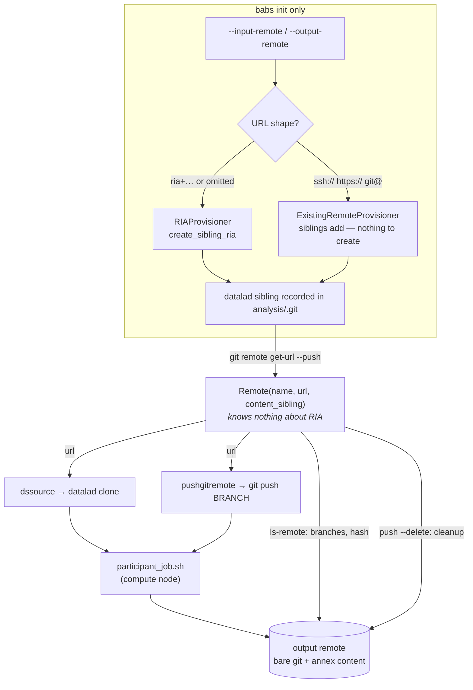

# Making the input/output remotes properly remote — and not necessarily RIA

Design for [PennLINC/babs#401](https://github.com/PennLINC/babs/issues/401):
*"Make RIAs properly 'Remote' (as via ssh or other way)"*.

## The ask

BABS assumes both the input and output store live on a filesystem that the
machine running the `babs` CLI can `open()`, `os.symlink()` and `cd` into —
and, in practice, that they sit *inside* `project_root`. The original
FAIRly-big recipe never assumed that: those remotes were expected to be real
remotes, because compute nodes may have no shared store at all. All the data
logistics are already handled by datalad/git-annex; only some housekeeping
commands reach for the paths directly.

A first pass at this design kept RIA as the mandated store type and only
taught it to speak `ssh`. That was too narrow. **BABS does not need RIA
stores; it needs a git remote it can push branches to and a place to put annex
content.** RIA is one way to provision that — a convenient one — but it is a
provisioning and layout convention, not a requirement of the workflow. This
revision demotes RIA from "the store type" to "one provisioning strategy", and
the result is *smaller* than the RIA-only version.

## What BABS actually requires of each side

Working backwards from every operation BABS performs:

**Input side** — used only by `participant_job.sh`:

| Operation | Where | Needs |
|---|---|---|
| `datalad clone "${dssource}" ds --no-checkout` | `participant_job.sh.jinja2:53` | any URL `datalad clone` accepts |
| `datalad push --to input` | `bootstrap.py:440`, `update.py:40,104` | a pushable git remote |

That is the entire input-side contract: **a bare git repository.**

**Output side:**

| Operation | Where | Needs |
|---|---|---|
| `git remote add outputstore "$pushgitremote"` + `git push $BRANCH` | `participant_job.sh.jinja2:58,198` | a git URL, concurrently pushable |
| `datalad push --to output-storage` | `participant_job.sh.jinja2:192` | somewhere to put annex content |
| `git ls-remote --heads` | `utils.py:466`, via `base.py:558` | any git transport |
| `git branch --delete` after merge | `merge.py:376-383` | ref deletion |
| `datalad clone <output> merge_ds` | `merge.py:150` | any clonable URL |
| `git annex fsck -f output-storage` / `find --not --in output-storage` | `merge.py:297,319` | a named git-annex remote holding the content |

That contract: **a bare git repository plus a git-annex remote for content.**

Nothing in either list is RIA-specific. Every one of these is plain
git / git-annex / datalad, all of which have been remote-capable for years.

## What RIA actually contributes here

Two `create_sibling_ria` calls (`bootstrap.py:181-197`), and what each buys:

```python
create_sibling_ria(name='output', url=self.output_ria_url, new_store_ok=True, ...)
create_sibling_ria(name='input',  url=self.input_ria_url,
                   storage_sibling=False,   # 'off' in the CLI
                   new_store_ok=True, ...)
```

- **auto-creation** of the bare repo (`new_store_ok=True`) — provisioning;
- the **ORA special remote** `output-storage` for annex content — one of
  several ways to hold content;
- the `<store>/<id[:3]>/<id[3:]>` **layout** and `#<dataset_id>` addressing —
  a directory convention;
- the `alias/data` **symlink** — human convenience;
- **shared-group permissions** (`shared=group`, `group=…`) — provisioning.

All provisioning and convention. And two observations sharpen the point:

**1. The input store is already not a RIA store in any meaningful sense.**
`storage_sibling=False` means it holds no annex content at all — it is a bare
git repo that happens to live under a RIA directory layout. Compute nodes
clone it for the refs and then pull data content from the input *subdatasets'*
own origins (`datalad get -n` per subject, then `datalad run`). Any bare git
repo — on ssh, on GitHub, anywhere — would serve identically.

**2. `analysis_dataset_id` exists only to build `#<id>` URLs.** It is
referenced in exactly two non-test places:

```
container.py:278  dssource = babs.input_ria_url + '#' + babs.analysis_dataset_id
merge.py:148      output_ria_source = self.output_ria_url + '#' + self.analysis_dataset_id
```

Both are RIA store-root addressing. Once a remote is identified by its own
URL, the dataset id is not needed for addressing at all — and the
multi-second `datalad wtf` subprocess that fetches it
(`base.py:373-381`, run on **every** BABS command via `_apply_config()`)
can go away with it.

**3. BABS puts exactly one dataset in each store.** RIA's whole reason to
exist — many datasets sharing one store, addressed by id — buys nothing here.

## Where BABS is today

`BABS.__init__` (`babs/base.py:149-157`) is the root of the assumption:

```python
self.input_ria_path = _resolve_subpath(
    self.project_root, cfg.get('input_ria_path', 'input_ria'), 'input_ria_path'
)
self.output_ria_path = _resolve_subpath(
    self.project_root, cfg.get('output_ria_path', 'output_ria'), 'output_ria_path'
)

self.input_ria_url = 'ria+file://' + self.input_ria_path
self.output_ria_url = 'ria+file://' + self.output_ria_path
```

Four restrictions in six lines:

1. **Scheme hard-coded** to `ria+file://`.
2. **Store type hard-coded** to RIA.
3. **A local path is the primary datum**, with the URL derived from it — the
   inverse of what any remote needs.
4. `_resolve_subpath` (`babs/base.py:47-57`) **rejects absolute paths and
   anything outside `project_root`**, so today not even a *local* store on a
   shared filesystem elsewhere on the cluster is possible.

There is also no CLI surface: `input_ria_path` / `output_ria_path` are
undocumented container-config keys that `babs init` copies to
`.babs/babs_init_config.yaml`. They are absent from the project's own
`analysis/code/babs_proj_config.yaml`, so remote location lives in a different
file from the rest of the project configuration.

### Inventory of local-only accesses

The **RIA?** column marks whether the site is coupled to RIA specifically, or
merely to *locality*. Most are the latter — which is why generalizing costs
little beyond the remote work itself.

| # | Site | What it does | Local-only because | RIA? |
|---|------|--------------|--------------------|------|
| A | `base.py:156-157` | builds store URLs | literal `'ria+file://'` prefix | yes |
| B | `base.py:346-368` | `wtf_key_info()` derives `output_ria_data_dir` | `urlparse(...).path` on the push URL, then `op.exists`/`op.realpath` on `alias/data` | partly |
| C | `container.py:278-280` | `dssource`, `pushgitremote` | hands compute nodes a bare local path | `#id` only |
| D | `bootstrap.py:450-457` | creates `output_ria/alias/data` | `os.makedirs` + `os.symlink` | yes |
| E | `bootstrap.py:156-157` | `.gitignore`s the store basenames | only meaningful if stores are inside `project_root` | no |
| F | `bootstrap.py:695-698`, `:702` | `babs init` failure cleanup | `op.exists(ria_path)`, then `rm -rf project_root` | no |
| G | `check_setup.py:185-247` | validates the stores | `os.readlink`, `op.exists`, path-equality vs sibling URL, hash compare via local paths | partly |
| H | `merge.py:376-383` | deletes merged branches | `subprocess.run(..., cwd=self.output_ria_data_dir)` | no |
| I | `base.py:453-461` | `git safe.directory` registration | `Path(ria_root).glob('*/*')` | layout |
| J | `base.py:388-390` | `source_to_local_path` | only understands `ria+file://` / `file://` | no |
| K | `merge.py:297,319`, `participant_job.sh.jinja2:192` | annex content ops | *(not local)* — hard-codes the name `output-storage` | yes |
| L | `utils.py:466-501` | `get_results_branches_from_ria` | *(none — `git ls-remote` is already URL-capable)* | no |
| M | `merge.py:148-150` | `datalad clone` of the output store | *(none — datalad handles remote URLs)* | `#id` only |

Two sites deserve individual attention.

**B is an active correctness bug for any non-`file` remote.** `wtf_key_info()`
reads the push URL datalad recorded for the `output` sibling and then discards
everything but the path component:

```python
self.output_ria_data_dir = urlparse(
    proc_output_ria_data_dir.stdout.decode('utf-8')
).path.strip()
```

For a local store that is a no-op. For an ssh remote it silently drops the
host:

```
urlparse('ssh://user@host:/data/output_ria/238/da2f2-uuid').path
    == '/data/output_ria/238/da2f2-uuid'
```

The host is gone and BABS proceeds as though that path were local. The
fallback below it — resolve `output_ria/alias/data` when the URL has no
`.git` — then fails to find the symlink and leaves the truncated path in
place.

**C is the load-bearing one.** `output_ria_data_dir` reaches every participant
job as `$2` and is used verbatim:

```sh
pushgitremote="$2"	# i.e., `output_ria`
git remote add outputstore "${pushgitremote}"
flock "${DSLOCKFILE}" git push outputstore "${BRANCH}"
```

Whatever we compute there *is* the URL each compute node pushes results to, so
it must survive as a full URL end to end. Upstream FAIRly-big's bootstrap uses
`pushgitremote=$(git remote get-url --push output)` unmodified; BABS's
`urlparse().path` is the only thing making it local.

## The key simplification

Ask git for the sibling's URL and don't mangle it.

```python
git --git-dir <analysis>/.git remote get-url --push output
```

Git cannot push to `ria+file://…#id` — that is not a git transport — so
whatever git has recorded for a working sibling is already a real, usable git
URL, whichever provisioner created it. Reading it whole is therefore the
**universal** mechanism: it works for RIA and non-RIA, local and remote, with
no layout knowledge, no `alias/data` symlink resolution, and no dataset id.

Note this is strictly *simpler* than the RIA-specific alternative of computing
`<store>/<id[:3]>/<id[3:]>` from a store URL and a dataset id. Generalizing
removes code rather than adding it. (The layout math is still worth keeping as
a RIA-only fallback, because `base.py:365-368` shows some datalad versions
record the store root rather than the dataset directory.)

And once we hold a URL rather than a path, the remaining housekeeping is plain
git, which is already remote-capable:

| Housekeeping today | Remote-capable equivalent |
|---|---|
| `cd <ria_data_dir> && git branch --delete …` (H) | `git push origin --delete …` from `merge_ds` (its `origin` *is* the output remote) |
| `op.exists(<ria_data_dir>)` (G) | `git ls-remote --exit-code <url> HEAD` |
| `get_repo_hash(<ria_data_dir>)` (G) | `git ls-remote <url> HEAD` |
| `git ls-remote --heads <ria_data_dir>` (L) | unchanged — already works |
| `os.symlink(… alias/data)` (D) | `create_sibling_ria(..., alias='data')`, RIA-only |

So the core workflow needs **no ssh shell access** at all. An ssh-exec escape
hatch is worth having for RIA housekeeping extras (`git gc`, permission
fixups), but nothing on the critical path depends on it.

## Proposed design

Two layers, and the split is the whole idea: **the core code talks to a dumb
remote; RIA knowledge lives only in provisioning.**

### 1. `Remote` — what the core code uses

New module `babs/remotes.py`. Deliberately ignorant of RIA:

```python
@dataclass(frozen=True)
class Remote:
    """A git(-annex) remote that BABS pushes to or clones from."""

    name: str                      # datalad sibling name: 'input' | 'output'
    url: str                       # git URL for refs — any transport
    content_sibling: str | None = None
        # datalad sibling holding annex content.
        # RIA -> 'output-storage'; plain annex remote -> None, meaning `name` itself.
        # Input side is always None-with-no-content.

    # --- pure git; identical for file/ssh/http ------------------------
    def exists(self) -> bool: ...                      # git ls-remote --exit-code
    def head_hash(self) -> str | None: ...             # git ls-remote HEAD
    def results_branches(self, timeout=30) -> list[str]: ...   # git ls-remote --heads
    def delete_branches(self, branches: list[str]) -> None: ...# git push --delete

    @classmethod
    def from_sibling(cls, analysis_path: str, name: str) -> 'Remote':
        """Read the recorded push URL — the universal mechanism above."""

    @property
    def is_local(self) -> bool: ...
    @property
    def local_path(self) -> str | None: ...            # None unless file/plain path
```

The word "RIA" does not appear in this class. `merge.py`, `status`,
`check_setup` and `container.py` use only this.

### 2. Provisioners — used by `babs init` only

```python
class Provisioner(Protocol):
    def provision(self, ds, name: str, shared_group: str | None) -> Remote: ...
    def teardown_hint(self) -> str: ...   # what to tell the user on init failure

class RIAProvisioner:
    """Today's behaviour. Creates the store if absent."""
    def __init__(self, store_url: str, with_content: bool): ...
    # create_sibling_ria(..., alias='data' for output), then Remote.from_sibling()

class ExistingRemoteProvisioner:
    """The user hands us a remote that already exists. Nothing to create."""
    def __init__(self, url: str, content_sibling: str | None): ...
    # datalad siblings add; verify pushable; then Remote.from_sibling()
```

This is the part of the user's framing that shapes the code: for an
already-existing remote there is genuinely **nothing to set up** — the
provisioner is a `siblings add` and a reachability check. A future
`BareSshProvisioner` (`ssh host git init --bare` + `siblings add`) slots in
without touching anything else.

### 3. `BABS` attribute changes

```python
self.input_remote  = Remote.from_sibling(self.analysis_path, 'input')
self.output_remote = Remote.from_sibling(self.analysis_path, 'output')
```

| Old attribute | New expression | Notes |
|---|---|---|
| `input_ria_url` | `self.input_remote.url` | now a git URL, not `ria+…` |
| `output_ria_url` | `self.output_remote.url` | same |
| `input_ria_path` | `self.input_remote.local_path` | **may be `None`** |
| `output_ria_path` | `self.output_remote.local_path` | **may be `None`** |
| `output_ria_data_dir` | `self.output_remote.url` | **path → URL** |
| `analysis_dataset_id` | *(gone from addressing)* | keep for identity checks only |

`output_ria_data_dir` cannot be preserved faithfully — its value changes from a
path to a URL. Its only consumers are C, H and `base.py:558`, all of which want
a URL, so rename it rather than silently redefine the old name.

### 4. `wtf_key_info()` retired

Its two jobs split cleanly: the URL comes from `Remote.from_sibling()`, and
`analysis_dataset_id` — no longer needed for addressing — is read from
`analysis/.datalad/config` (`datalad.dataset.id`, a plain file read) when
wanted. The `flag_output_ria_only` parameter and the per-command
`datalad wtf` subprocess both disappear.

### 5. `babs init` surface

```
babs init … [--input-remote URL] [--output-remote URL]
```

Dispatch on what the user passes, so RIA stays the zero-config default:

| Argument | Provisioner |
|---|---|
| *(omitted)* | `RIAProvisioner('ria+file://<project_root>/{input,output}_ria')` — today's behaviour |
| `ria+file://…`, `ria+ssh://…` | `RIAProvisioner` |
| absolute path | `RIAProvisioner('ria+file://<path>')` — unblocks local-but-outside-project |
| `ssh://…`, `https://…`, `git@…` | `ExistingRemoteProvisioner` |

Persist the *resolved* remotes in `analysis/code/babs_proj_config.yaml`:

```yaml
remotes:
  input:
    url: 'ssh://user@host/data/babs/analysis'
  output:
    url: 'ssh://user@host/data/babs/analysis'
    content_sibling: 'output-storage'   # omit when content lives in the remote itself
    store: 'ria+ssh://user@host/data/babs/output_ria'   # optional, for RIA management
```

so remote location lives with the rest of the project config. Projects with no
`remotes:` section fall back to `<project_root>/{input,output}_ria` — existing
projects keep working untouched.

### 6. Guarding the local-only and RIA-only sites

- **E** (`.gitignore`): add basenames only when `local_path` is inside
  `project_root`.
- **F** (cleanup): `rm -rf project_root` cannot reach a remote. Refuse to
  auto-delete remote state and print the provisioner's `teardown_hint()`
  verbatim. Silently orphaning a remote store is the worst outcome; deleting
  remote data on an error path is the second worst.
- **I** (`safe.directory`): skip non-local remotes.
- **J**: already returns `None` for unknown schemes; callers keep tolerating it.
- **K**: replace the three hard-coded `output-storage` strings with
  `output_remote.content_sibling or output_remote.name`.

### 7. `check_setup` over git

Replace the `readlink`/`op.exists`/path-comparison block (G) with:

```python
for remote in (self.input_remote, self.output_remote):
    if not remote.exists():
        raise FileNotFoundError(f"'{remote.name}' remote not reachable: {remote.url}")
    compare_hashes(get_repo_hash(self.analysis_path), remote.head_hash(),
                   'analysis', f'{remote.name} remote')
```

`compare_repo_commit_hashes(repo1, repo2, …)` (`utils.py:592`) currently takes
two *repos* and hashes both; split it into `get_repo_hash()` (local) plus a
pure comparison so the remote side can supply an `ls-remote` hash.

The sibling-URL equality check (`check_setup.py:212`) compares a datalad
sibling URL against a filesystem path; drop it in favour of the reachability
and hash checks above, which test what actually matters.

### 8. Job scripts

`container.py:278-280` becomes:

```python
dssource      = babs.input_remote.url          # no '#' + dataset_id
pushgitremote = babs.output_remote.url
```

`participant_job.sh.jinja2` needs one change — the content-push line becomes
templated:

```sh
datalad push --to {{ content_sibling }}
```

The two-phase push (content first, unlocked; refs second, under `flock`) is
worth preserving as-is: annex content is content-addressed and has no ref
contention, so only the branch push needs serialising. When
`content_sibling` is a separate special remote (the RIA/ORA case) this is
unchanged from today.

⚠️ **Needs cluster validation before the non-RIA output mode is offered:** when
content lives in the git remote itself, the content phase becomes
`git annex copy --to <remote>`, which updates git-annex location tracking on
the remote side. git-annex is designed for concurrent access, but BABS runs
hundreds of concurrent jobs and I have not verified this at that scale. Until
it is measured, `ExistingRemoteProvisioner` should require an explicit
`content_sibling` (a separate special remote) for the output side.

Documented requirement for ssh remotes: compute nodes must be able to `ssh`
non-interactively to the host (agent forwarding or a key), and — for RIA —
datalad's ORA special remote must be usable from the nodes.

### Flow after the refactor



## Phasing

Each phase is independently mergeable and leaves `main` working.

**Phase 0 — fix the truncation bug.** Stop discarding scheme/host in
`wtf_key_info()` (B). Small, self-contained, correct regardless of the rest.

**Phase 1 — introduce `Remote`, behaviour-preserving.** Add `babs/remotes.py`,
route every inventory site through it, keep RIA as the only provisioner and
`ria+file://` as the only scheme. Mechanical and reviewable against the table.
Unit-testable without a cluster.

**Phase 2 — replace filesystem housekeeping with git.** H
(`git push --delete`), G (`ls-remote` checks), D (`alias='data'`), K
(parametrised content sibling). Still `file`-only, so the existing e2e suite is
the regression test: all of these must behave identically on a local RIA store
before any remote is offered.

**Phase 3 — accept remote URLs.** `--input-remote` / `--output-remote`, the
`remotes:` config section, `ExistingRemoteProvisioner`, the guards in §6,
docs. First phase where `ria+ssh://` or a plain bare repo works.

**Phase 4 — the remaining shared-filesystem coupling (out of scope, flagged).**
Remote stores are necessary but not sufficient for the issue's "compute nodes
might not have any shared store". `participant_job.sh` still requires nodes to
share `analysis_path` for three unrelated reasons:

- container images are symlinked from `{{ analysis_path }}/…`
  (`participant_job.sh.jinja2`, container-linking block);
- `DSLOCKFILE=<analysis_path>/.SLURM_datalad_lock` serialises the concurrent
  `git push` (`container.py:267`);
- scheduler stdout/stderr go to `<analysis_path>/logs/` (`container.py:299-302`).

The lock exists *because* many jobs push to one repo; making the remote remote
does not remove the need, it changes the question to "how do we serialise
pushes without a shared lock file" — server-side ref locking, retry with
backoff on non-fast-forward, or per-job refs. Worth its own issue.

## Testing

- **Unit** — `Remote` is pure git plumbing over a URL, so most of it tests
  against `git init --bare` fixtures in `tmp_path` with **no datalad and no
  cluster**: `exists`, `head_hash`, `results_branches`, `delete_branches`.
  That is a real coverage gain over the current path-based code.
- **Regression** — pin the Phase-0 fix: an `ssh://user@host:/path` push URL
  must not lose `user@host`.
- **Existing e2e unchanged** — `tests/e2e-slurm/` must pass byte-identically
  through Phases 1-2. That is the safety net for the git-for-filesystem swap.
  Note `tests/test_check_setup.py:52,83` and `tests/test_merge.py:70,288`
  assert on `ria+file://…#<id>` URLs and will need updating in Phase 1.
- **New e2e** — the slurm test container can host both a `ria+ssh://localhost`
  store and a plain `git init --bare` repo reached over `ssh://localhost`,
  exercising both provisioners against the real `datalad clone` / `git push`
  path with no external infrastructure.
- **Capability errors** — an `http` output remote (read-only) must be rejected
  at `babs init` with a clear message, not fail at the first job.

## Open questions

1. **Should input and output ever be the same remote?** The abstraction
   permits it, and it would halve setup. But the split is a *performance*
   decision, not a RIA one: the input remote is pushed once at init and never
   gains job branches, so per-job `datalad clone` stays cheap, while the output
   remote accumulates thousands of `job-*` refs that every clone would
   otherwise fetch. Recommend keeping two by default and not advertising the
   single-remote option until measured.
2. **Concurrent `git annex copy --to` at BABS scale** — see the warning in §8.
   This gates whether a plain annex remote (no separate content sibling) is a
   supported output configuration.
3. **`babs init` failure cleanup with a remote (F).** Auto-delete over ssh, or
   refuse and instruct? Suggest refuse + print the exact command, and let the
   provisioner supply it.
4. **Which schemes for Phase 3?** `ria+ssh://` and `ssh://` cover the issue.
   `http(s)://` is push-capable only for hosted forges; a read-only `http` RIA
   can serve as an *input* remote but must be rejected for output.
5. **Should `merge_ds` stay under `project_root`?** Cloned from the output
   remote and potentially large; with a remote store a scratch directory may be
   the better default. Orthogonal, but the same PR touches the code.
