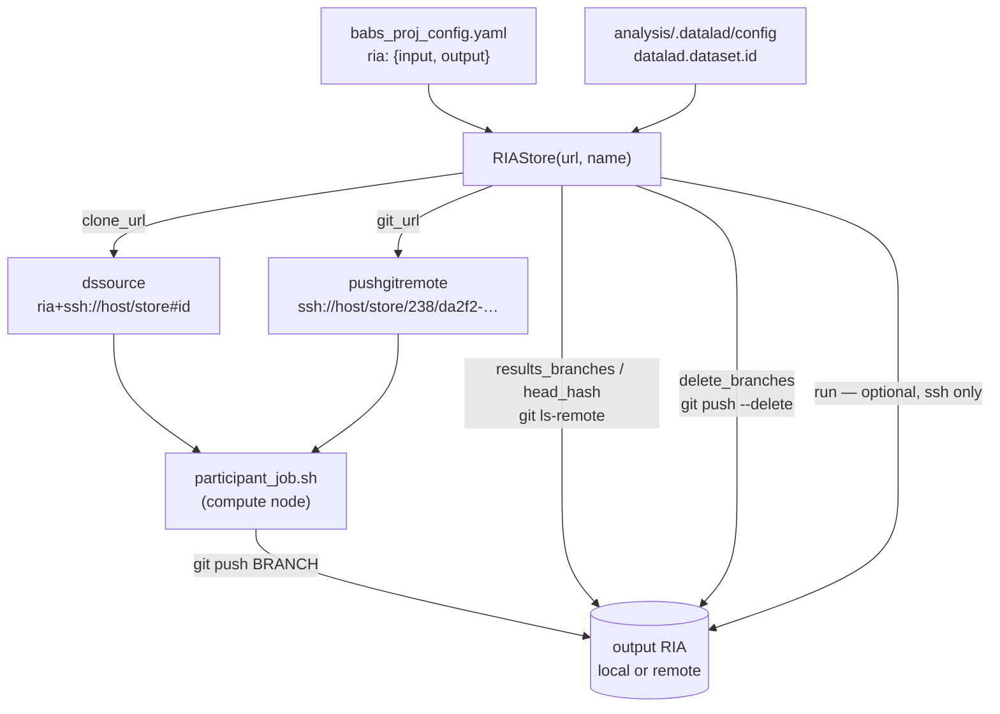

# Making RIA stores properly "remote"

Design for [PennLINC/babs#401](https://github.com/PennLINC/babs/issues/401):
*"Make RIAs properly 'Remote' (as via ssh or other way)"*.

## The ask

BABS currently assumes both RIA stores live on a filesystem that the machine
running the `babs` CLI can `open()`, `os.symlink()` and `cd` into — and, in
practice, that they sit *inside* `project_root`. The original FAIRly-big
recipe never assumed that: input/output RIA stores were expected to be real
remotes, because compute nodes may have no shared store at all. All the data
logistics are already handled by datalad/git-annex; only some housekeeping
commands reach for the paths directly.

This document inventories every one of those reach-arounds and proposes how to
remove them.

## Where BABS is today

`BABS.__init__` (`babs/base.py:149-157`) is the root of the assumption:

```python
self.input_ria_path = _resolve_subpath(
    self.project_root, cfg.get('input_ria_path', 'input_ria'), 'input_ria_path'
)
self.output_ria_path = _resolve_subpath(
    self.project_root, cfg.get('output_ria_path', 'output_ria'), 'output_ria_path'
)

self.input_ria_url = 'ria+file://' + self.input_ria_path
self.output_ria_url = 'ria+file://' + self.output_ria_path
```

Three separate restrictions are baked in here:

1. **Scheme is hard-coded** to `ria+file://`.
2. **A local path is the primary datum**, and the URL is derived from it —
   the inverse of what a remote store needs.
3. `_resolve_subpath` (`babs/base.py:47-57`) **rejects absolute paths and
   anything outside `project_root`**. So today not even a *local* store on a
   shared filesystem elsewhere on the cluster can be used.

There is also no CLI surface for any of it: `input_ria_path` /
`output_ria_path` are undocumented keys read from the container config, which
`babs init` copies to `.babs/babs_init_config.yaml` and every later command
re-reads. They are not recorded in the project's own
`analysis/code/babs_proj_config.yaml`, so RIA location lives in a different
file from the rest of the project configuration.

### Inventory of local-only accesses

| # | Site | What it does | Local-only because |
|---|------|--------------|--------------------|
| A | `base.py:156-157` | builds store URLs | literal `'ria+file://'` prefix |
| B | `base.py:346-368` | `wtf_key_info()` derives `output_ria_data_dir` | `urlparse(...).path` on the push URL, then `op.exists`/`op.realpath` on the `alias/data` symlink |
| C | `container.py:280` | `pushgitremote = babs.output_ria_data_dir` | hands compute nodes a bare local path |
| D | `bootstrap.py:450-457` | creates `output_ria/alias/data` | `os.makedirs` + `os.symlink` |
| E | `bootstrap.py:156-157` | `.gitignore`s the store basenames | only meaningful if stores are inside `project_root` |
| F | `bootstrap.py:695-697`, `:702` | `babs init` failure cleanup | `op.exists(ria_path)`, then `rm -rf project_root` |
| G | `check_setup.py:185-247` | validates the stores | `os.readlink`, `op.exists`, path-equality against the sibling URL, hash compare via local paths |
| H | `merge.py:380` | deletes merged branches | `subprocess.run(..., cwd=self.output_ria_data_dir)` |
| I | `base.py:453-461` | `git safe.directory` registration | `Path(ria_root).glob('*/*')` |
| J | `base.py:388-390` | `source_to_local_path` | only understands `ria+file://` / `file://` |
| K | `utils.py:466-501` | `get_results_branches_from_ria` | *(none — `git ls-remote` is already URL-capable)* |
| L | `merge.py:148` | `datalad clone` of the output store | *(none — datalad handles `ria+ssh://`)* |

Two of these deserve to be called out individually.

**B is an active correctness bug for any non-`file` store.** `wtf_key_info()`
reads the push URL datalad set on the `output` sibling and then throws away
everything but the path component:

```python
self.output_ria_data_dir = urlparse(
    proc_output_ria_data_dir.stdout.decode('utf-8')
).path.strip()
```

For a local store that is a no-op. For an ssh store it silently discards the
host:

```
urlparse('ssh://user@host:/data/output_ria/238/da2f2-uuid').path
    == '/data/output_ria/238/da2f2-uuid'
```

The host is gone, and BABS proceeds as if that path were local. The fallback
below it — resolving `output_ria/alias/data` when the URL has no `.git` — then
fails to find the symlink and leaves the truncated path in place.

**C is the load-bearing one.** `output_ria_data_dir` is passed to every
participant job as `$2` and used verbatim:

```sh
pushgitremote="$2"	# i.e., `output_ria`
...
git remote add outputstore "${pushgitremote}"
...
flock "${DSLOCKFILE}" git push outputstore "${BRANCH}"
```

Whatever we compute here *is* the URL each compute node pushes results to, so
it must survive as a full URL end to end. Notably, upstream FAIRly-big's
bootstrap uses `pushgitremote=$(git remote get-url --push output)` unmodified;
BABS's `urlparse().path` is the only thing that makes it local.

## The key simplification

A RIA store's on-disk layout is deterministic:

```
<store>/<dataset_id[:3]>/<dataset_id[3:]>
```

e.g. dataset `238da2f2-2fc4-4b88-a2c5-aa6e754b5d0b` in store `/proj/output_ria`
lives at `/proj/output_ria/238/da2f2-2fc4-4b88-a2c5-aa6e754b5d0b`.

That means **the dataset's git URL is computable from (store URL, dataset id)
alone** — no filesystem probing, no `git remote get-url`, no `alias/data`
symlink resolution. The whole of B collapses to string manipulation that works
identically for `file` and `ssh`.

And once we have a URL rather than a path, almost every remaining housekeeping
operation can be expressed in plain git, which is already remote-capable:

| Housekeeping today | Remote-capable equivalent |
|---|---|
| `cd <ria_data_dir> && git branch --delete …` (H) | `git push origin --delete …` from `merge_ds` (its `origin` *is* the store dataset), or `git push <git_url> --delete …` |
| `op.exists(<ria_data_dir>)` (G) | `git ls-remote --exit-code <git_url> HEAD` |
| `get_repo_hash(<ria_data_dir>)` (G) | `git ls-remote <git_url> HEAD` |
| `git ls-remote --heads <ria_data_dir>` (K) | unchanged — already works |
| `os.symlink(... alias/data)` (D) | `create_sibling_ria(..., alias='data')` |

So the design needs **no ssh shell access** for the core workflow. An
ssh-exec escape hatch is worth having for optional extras (`git gc`,
permission fixups), but nothing on the critical path depends on it.

## Proposed design

### 1. A `RIAStore` value object

New module `babs/ria.py`. The store URL becomes the primary datum; the local
path becomes a derived, optional convenience.

```python
@dataclass(frozen=True)
class RIAStore:
    """A DataLad RIA store, local or remote."""

    url: str        # canonical datalad RIA URL: 'ria+file:///…', 'ria+ssh://user@host/…'
    name: str       # sibling name: 'input' or 'output'

    # --- introspection -------------------------------------------------
    @property
    def scheme(self) -> str: ...          # 'file', 'ssh', 'http', …
    @property
    def is_local(self) -> bool: ...       # scheme == 'file'
    @property
    def local_path(self) -> str | None:   # None when not local
        ...

    # --- addressing ----------------------------------------------------
    def clone_url(self, dataset_id: str) -> str:
        """datalad clone source: '<url>#<dataset_id>'."""

    def git_url(self, dataset_id: str) -> str:
        """Plain git URL of the dataset repo inside the store.

        ria+file:///proj/output_ria      -> /proj/output_ria/238/da2f2-…
        ria+ssh://user@host/data/out_ria -> ssh://user@host/data/out_ria/238/da2f2-…
        """

    # --- housekeeping (git-protocol only; works local or remote) --------
    def dataset_exists(self, dataset_id: str) -> bool: ...
    def head_hash(self, dataset_id: str) -> str | None: ...
    def results_branches(self, dataset_id: str, timeout: int = 30) -> list[str]: ...
    def delete_branches(self, dataset_id: str, branches: list[str]) -> None: ...

    # --- escape hatch, non-critical paths only -------------------------
    def run(self, argv: list[str], subdir: str = '') -> subprocess.CompletedProcess:
        """Run a command inside the store: subprocess locally, `ssh host …` remotely.

        Raises RIACapabilityError for schemes with no shell (http, s3).
        """
```

`from_config()` constructs one from either a URL or a legacy relative path,
so `ria+file://` construction happens in exactly one place.

### 2. `BABS` attribute changes

```python
self.input_ria  = RIAStore.from_config(..., name='input')
self.output_ria = RIAStore.from_config(..., name='output')
```

Existing attributes become thin, deprecated properties so the diff stays
reviewable and third-party code keeps working for a release:

| Old attribute | New expression | Notes |
|---|---|---|
| `input_ria_url` | `self.input_ria.url` | keep as property |
| `output_ria_url` | `self.output_ria.url` | keep as property |
| `input_ria_path` | `self.input_ria.local_path` | **may be `None`**; every use site must handle it |
| `output_ria_path` | `self.output_ria.local_path` | same |
| `output_ria_data_dir` | `self.output_ria.git_url(self.analysis_dataset_id)` | **semantic change: URL, not path** |

`output_ria_data_dir` is the one that cannot be preserved faithfully — its
value changes from a path to a URL. Since its only consumers are C, H and the
`get_results_branches` call in `base.py:558`, all of which want a URL, the
cleanest move is to rename it (`output_ria_dataset_url`) rather than silently
change what the old name means.

### 3. `wtf_key_info()` inverted

`analysis_dataset_id` is currently fetched only when
`flag_output_ria_only=False`, because `output_ria_data_dir` was derivable
without it. In the new scheme the dependency reverses: the dataset id is the
*cheap, always-needed* datum and the store URL comes from config.

```python
def wtf_key_info(self) -> None:
    """Determine `analysis_dataset_id` from the `analysis` dataset."""
```

Read it from `analysis/.datalad/config` (`datalad.dataset.id`) — a file read,
no subprocess — with the existing `datalad wtf` call as fallback. This drops a
multi-second `datalad` invocation from `_apply_config()`, which runs on *every*
BABS command, and removes the `flag_output_ria_only` flag entirely.

### 4. `babs init` surface

Add explicit options, defaulting to today's behaviour:

```
babs init … [--input-ria URL_OR_PATH] [--output-ria URL_OR_PATH]
```

- Default: `ria+file://<project_root>/input_ria` and `…/output_ria`.
- A bare absolute path is accepted and normalised to `ria+file://<path>` —
  this alone unblocks the "local store on shared filesystem outside the
  project" case that `_resolve_subpath` rejects today.
- A relative path stays relative to `project_root` (back-compat with the
  current YAML keys).

Persist the resolved URLs in `analysis/code/babs_proj_config.yaml`:

```yaml
ria:
  input:  'ria+ssh://user@host/data/babs/input_ria'
  output: 'ria+ssh://user@host/data/babs/output_ria'
```

so RIA location lives with the rest of the project config rather than in
`.babs/babs_init_config.yaml`. Projects without the `ria:` section fall back to
`<project_root>/{input,output}_ria` — old projects keep working untouched.

Store creation itself already handles remotes; only the alias changes:

```python
self.analysis_datalad_handle.create_sibling_ria(
    name='output', url=self.output_ria.url,
    alias='data',            # replaces the manual os.symlink (D)
    new_store_ok=True, **sibling_kwargs,
)
```

### 5. Guarding the local-only sites

Each of E, F, I becomes conditional rather than unconditional:

- **E** (`.gitignore`): only add the basenames when the store's `local_path`
  is inside `project_root`.
- **F** (cleanup): `rm -rf project_root` no longer reaches a remote store. For
  remote stores, either delete them explicitly over their git URL, or — safer —
  refuse to auto-delete and print exactly what the user must remove by hand.
  Silently orphaning a remote store is the worst option.
- **I** (`safe.directory`): skip non-local stores; nothing to register.
- **J** (`source_to_local_path`): already returns `None` for unknown schemes;
  callers just need to keep tolerating `None`.

### 6. `check_setup` over git

Replace the `readlink`/`op.exists`/path-comparison block (G) with:

```python
for store in (self.input_ria, self.output_ria):
    if not store.dataset_exists(self.analysis_dataset_id):
        raise FileNotFoundError(f'{store.name} RIA dataset not reachable: …')

compare_repo_commit_hashes(
    get_repo_hash(self.analysis_path),
    self.input_ria.head_hash(self.analysis_dataset_id),
    'analysis', 'input RIA',
)
```

`compare_repo_commit_hashes(repo1, repo2, …)` (`utils.py:592`) currently takes
two *repos* and hashes both. Split it into `get_repo_hash()` (local) plus a
pure comparison, so the remote side can supply a hash obtained via
`git ls-remote`.

The sibling-URL equality check (`check_setup.py:212`) compares a datalad
sibling URL to a filesystem path; it should compare normalised URLs, or be
dropped in favour of the reachability + hash checks above, which test the thing
that actually matters.

### 7. Job scripts

`container.py:278-280` becomes:

```python
dssource     = babs.input_ria.clone_url(babs.analysis_dataset_id)
pushgitremote = babs.output_ria.git_url(babs.analysis_dataset_id)
```

`participant_job.sh.jinja2` needs **no change** — it already treats both as
opaque strings. What it does need is a documented requirement: with an ssh
store, compute nodes must be able to `ssh` to the RIA host non-interactively
(agent forwarding or a key), and datalad's ORA special remote must be usable
for `datalad push --to output-storage`.

### Flow after the refactor



## Phasing

Each phase is independently mergeable and leaves `main` working.

**Phase 0 — fix the truncation bug.** Stop discarding the scheme/host in
`wtf_key_info()` (B). Small, self-contained, and correct regardless of whether
the rest of this lands.

**Phase 1 — introduce `RIAStore`, still `file`-only.** Add `babs/ria.py`, route
every site in the inventory through it, keep `ria+file://` as the only
constructed scheme. Behaviour-preserving; the diff is mechanical and reviewable
against the table above. Unit-testable without a cluster.

**Phase 2 — replace filesystem housekeeping with git.** H (`git push --delete`),
G (`ls-remote` checks), D (`alias='data'`). Still `file`-only, so the existing
e2e suite is the regression test: every one of these must behave identically on
a local store before any remote store is offered.

**Phase 3 — accept non-`file` URLs.** `--input-ria` / `--output-ria`, the
`ria:` config section, the guards in §5, docs. This is the first phase where a
user can point BABS at `ria+ssh://`.

**Phase 4 — the remaining shared-filesystem coupling (out of scope, flagged).**
Remote RIA stores are necessary but not sufficient for the issue's "compute
nodes might not have any shared store". `participant_job.sh` still requires
compute nodes to share `analysis_path` for three unrelated reasons:

- container images are symlinked from `{{ analysis_path }}/…`
  (`participant_job.sh.jinja2`, container-linking block);
- `DSLOCKFILE=<analysis_path>/.SLURM_datalad_lock` serialises the concurrent
  `git push` (`container.py:267`);
- scheduler stdout/stderr go to `<analysis_path>/logs/` (`container.py:298+`).

The lock in particular exists *because* many jobs push to one repo; making the
store remote does not remove the need for it, it moves the question to "how do
we serialise pushes without a shared lock file" (server-side ref locking, retry
with backoff on non-fast-forward, or per-job refs). Worth its own issue.

## Testing

- **Unit** — `RIAStore` URL algebra: `git_url()` / `clone_url()` across
  `file`, `ssh` with and without user and port, trailing slashes, and the
  `<id[:3]>/<id[3:]>` split. Pure string work, no datalad needed. Add a
  regression test pinning the Phase-0 fix: an `ssh://user@host:/path` push URL
  must not lose `user@host`.
- **Existing e2e, unchanged** — `tests/e2e-slurm/` must pass byte-identically
  through Phases 1-2. That is the safety net for the git-for-filesystem swap.
- **New e2e** — the slurm test container can host an ssh RIA store addressed as
  `ria+ssh://localhost/…` from within the same container, exercising the real
  `datalad clone` / `git push` path without external infrastructure.
- **Capability errors** — `RIAStore.run()` on an `http` store must raise a
  clear `RIACapabilityError`, not a confusing subprocess failure.

## Open questions

1. **`babs init` failure cleanup with a remote store (F).** Auto-delete over
   ssh, or refuse and instruct? Deleting remote data on an error path is
   risky; instructing is safe but leaves the user with manual work. Suggest:
   refuse, print the exact `ssh host rm -rf …` command.
2. **Which schemes to support in Phase 3?** `ria+ssh://` covers the issue.
   `ria+http://` is read-only (no push) so it can only ever serve as an *input*
   store — worth allowing for `--input-ria`, but it must be rejected for
   `--output-ria` with a clear message rather than failing at the first job.
3. **Push serialisation without a shared lock.** Phase 4, but the answer shapes
   whether Phase 3's ssh support is genuinely useful for the no-shared-store
   case or only for "shared analysis dir, remote store".
4. **Should `merge_ds` stay under `project_root`?** It is cloned from the
   output store and can be large; with a remote store the natural place may be
   a scratch directory. Orthogonal, but the same PR touches the code.
